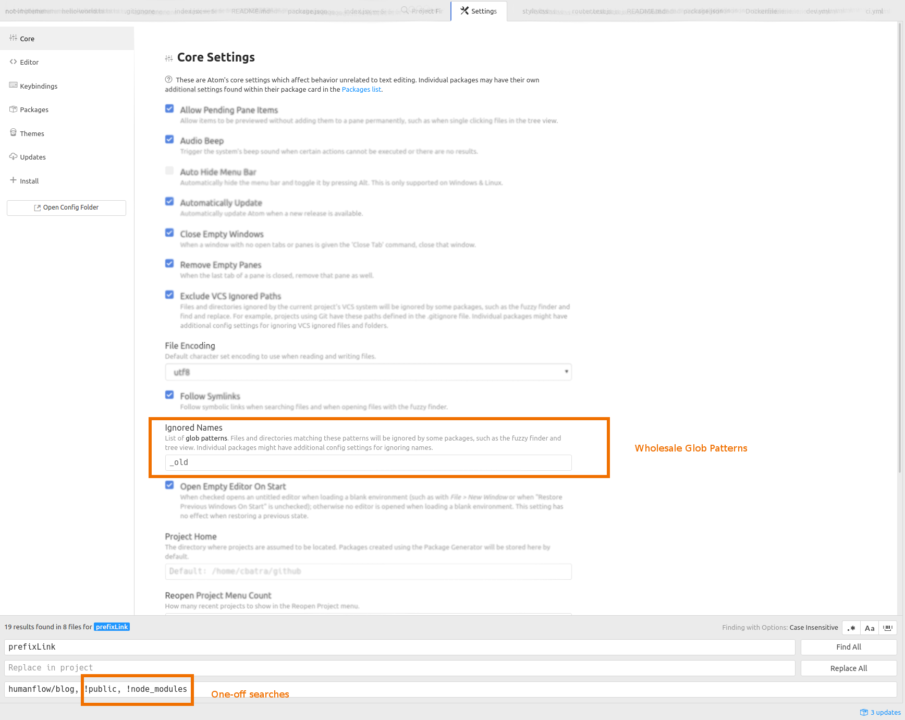

Here are two ways for getting Atom to ignore specific folders such as `npm_modules`:

1. "Ignored Names" in "Core Settings"
2. By comma-separated bang-prefixed names in search itself: so something like "humanflow/blog, !public, !node_modules"

<figure>
	
	<figcaption>Optimizing Search through Globpatterns</figcaption>
</figure>
